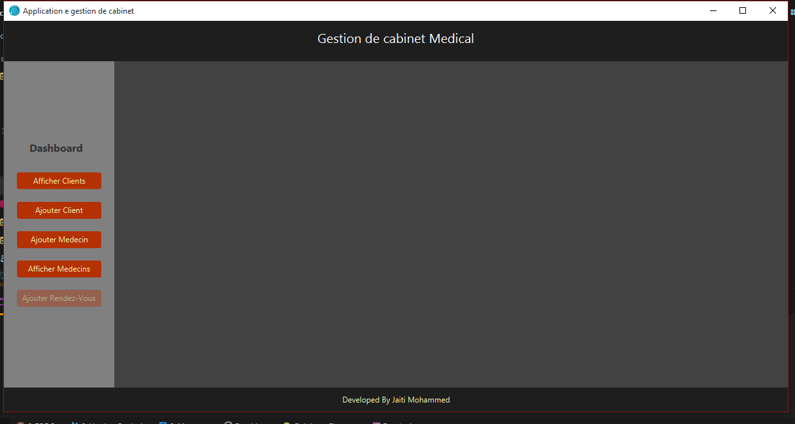
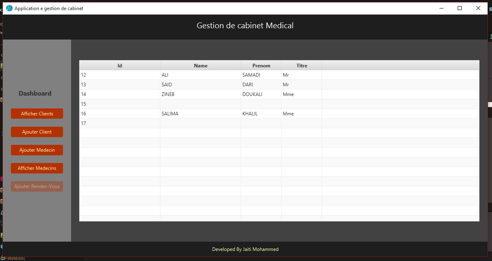
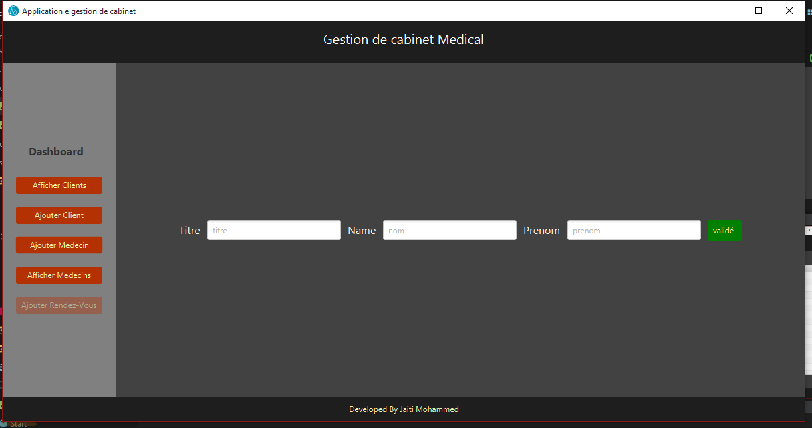
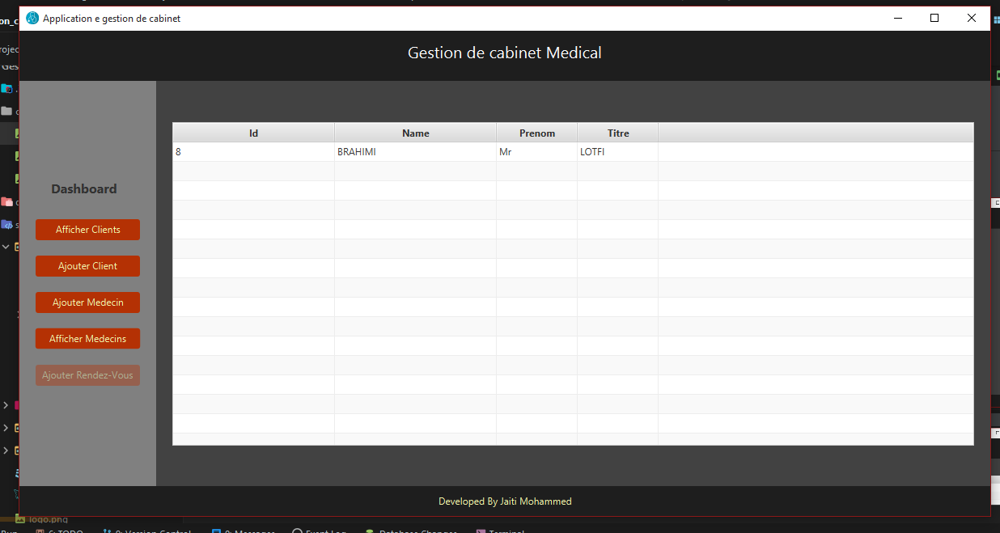

# Gestion_cabinet_medical
Application Desktop using javaFX &amp; JDBC

**Simple Application Desktop :**
* Tools : JavaFX - JavaSE
* Dao & Singleton
* JDBC 

cette partie comprend juste une implémentation de CRUD communiquant
avec la base de donnée MySQL

